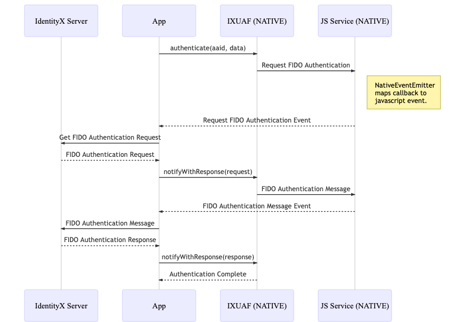

# React Native sample

This is a basic sample application and SDK bridge code for the xAuth FIDO SDK using React Native.

- [xAuth FIDO SDK Android](https://github.com/daoninc/fido-sdk-android)
- [xAuth FIDO SDK iOS](https://github.com/daoninc/fido-sdk-ios)

## License
The native FIDO SDK requires a license that is bound to an application identifier. This license may in turn embed licenses that are required for specific authenticators. Contact Daon Support or Sales to request a license.

## SDK repository

### Android
In your project-level build.gradle file, make sure to include the Daon Maven repository in your buildscript or allprojects sections.

[Daon Maven repository](https://github.com/daoninc/sdk-packages/blob/main/README.md)

### iOS
The iOS project already declares the Daon FIDO SDK package. Xcode resolves it automatically when you open or build `ios/FIDOProject.xcworkspace`.

| Setting | Value |
| --- | --- |
| Package URL | `https://github.com/daoninc/fido-sdk-ios` |
| Version rule | From `4.10.46` up to, but not including, `5.0.0` |
| Linked products | `DaonFIDOSDK`, `DaonAuthenticatorPasscode` |

The resolved version is committed in `ios/FIDOProject.xcodeproj/project.xcworkspace/xcshareddata/swiftpm/Package.resolved`. To refresh the package, open `ios/FIDOProject.xcworkspace` in Xcode and choose **File > Packages > Update to Latest Package Versions**. Review and commit the resulting `Package.resolved` change when upgrading.

To add the same dependency to another iOS target, choose **File > Add Package Dependencies…**, enter the package URL above, select the version rule, and add both listed products to the target. The React Native bridge imports `DaonFIDOSDK` directly.
    
## Prerequisites

- Node.js 22.11.0 or later
- Android 7.0 (API level 24) or later
- iOS 15.1 or later

## Getting started

1. Install React Native and Cocoapods
    
    [React Native](https://reactnative.dev/docs/integration-with-existing-apps?language=apple&package-manager=npm)

2. Install the iOS SDK with Swift Package Manager


3. Install and update node modules

    `$ npm install`

4. Install and update CocoaPods

    `$ cd ios`
   
    `$ pod install`

5. Update server settings in network.js

    ```
    let server          = 'https://my-server.com/my-app/IdentityXServices/rest/v1/';
    let username        = "username";
    let password        = "password";
    ```

6. Update the facets on the IdentityX Admin Console

    Run the sample and open **Settings**. Copy the **Facet ID** displayed below the username, then add it to the IdentityX Admin Console's trusted facets.

    For the iOS sample, the displayed facet ID is `ios:bundle-id:com.daon.sdk.react.FIDOProject`.

7. Run sample

    `$ npm start`

    Or:

    `$ npm run android`    

    `$ npm run ios`

See [xAuth FIDO Android Documentation](https://developer.identityx-cloud.com/client/fido/android/) and [xAuth FIDO iOS Documentation](https://developer.identityx-cloud.com/client/fido/ios/) for details and additional information.

## Sample
The SDK will call the IXUAFServiceDelegate delegate for handling FIDO related communication with the server. It is up to the application to provide an implementation of the IXUAFServiceDelegate protocol. 

This means that the IXUAFServiceDelegate has to be done entirely in native code or we need to map the delegate calls to JavaScript, so that the server communication can be done from JavaScript.

React Native provides a couple of ways to communicate between native code and JavaScript, e.g. callbacks, events, etc. For our sample we chose to use events to map the delegate calls back to JavaScript.

The flow is as follows:



- The React Native application authenticates with the given AAID and optional data (e.g. a passcode).
- The FIDO SDK (IXUAF API) sends a FIDO authentication request message to the IXUAFServiceDelegate, JS Service.
- The JS Service uses NativeEventEmitter to send the event to the React Native JavaScript application.
- The application communicates with the server using IdentityX REST API (or RPSA, etc.).
- The application receives the response from the server and notifies the SDK by calling the `notifyWithResponse` SDK method.
- The SDK provides a FIDO authentication message to the JS Service.
- The JS Service sends the message to the application.
- The application sends the message to the server.
- The application receives the response from the server and notifies the SDK by calling `notifyWithResponse`.
- The authenticate provides the application with a response.
